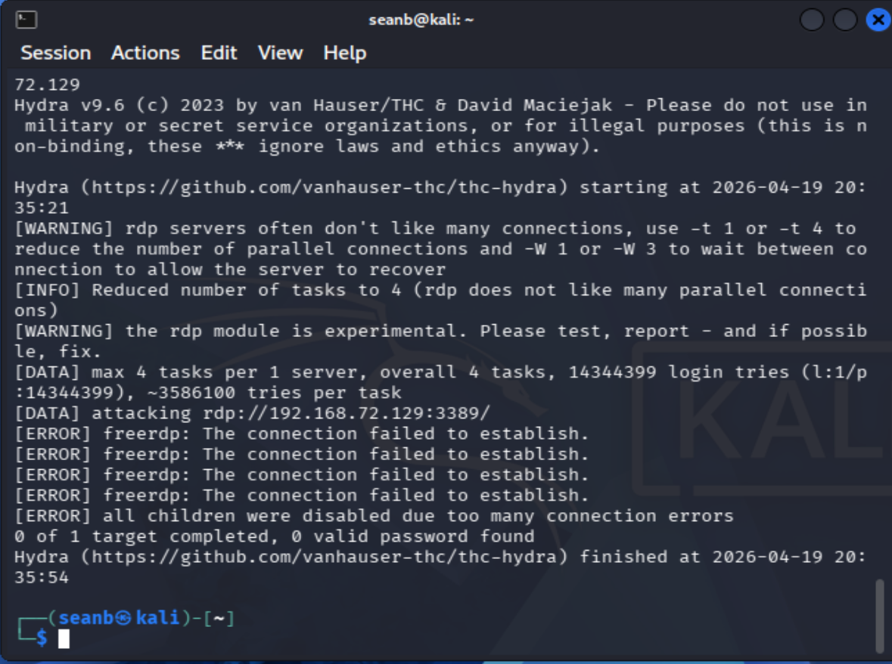

# Wazuh SIEM SOC Analyst Home Lab
**A Complete End-to-End Detection Pipeline Case Study**

## I. Executive Summary
This project demonstrates a fully functional Security Information and Event Management (SIEM) environment built using Wazuh, Windows 10, and Kali Linux.  

The lab simulates a realistic SOC workflow:

-An attacker performs reconnaissance
-Attempts unauthorized authentication
-Creates a persistence account
-Windows logs the activity
-Wazuh ingests, correlates, and alerts
-The analyst investigates and validates detections

This README documents the end‑to‑end detection pipeline, showcasing practical SOC analyst skills.

## II. Lab Architecture  

A three‑machine virtual SOC environment:

- Kali Linux — attacker machine (recon, brute force, enumeration)
- Windows 10 — monitored endpoint (Sysmon + Wazuh agent)
- Wazuh SIEM (Ubuntu 22.04) — centralized log collection, indexing, alerting, and analysis

Kali (Attacker)  

      ↓  
      
Windows 10 (Endpoint → Sysmon → Wazuh Agent)  

      ↓  
      
Wazuh SIEM (Manager + Indexer + Dashboard)

## III. Technology Stack
- Wazuh SIEM 4.14
- vUbuntu Server 22.04 LTS
- Windows 10 Enterprise
- Sysmon + SwiftOnSecurity config
- Kali Linux (Debian 13.x)
- VMware Workstation

## IV. Environment Setup

### Kali Linux

- Installed Debian‑based Kali ISO
- Updated system packages
- Installed VMware tools

### Windows 10 Endpoint 

- Installed Windows 10 ISO  
- Installed Sysmon  
- Installed Wazuh agent  
- Started agent service (net Start wazuh)

### Wazuh SIEM 

- Downloaded and executed Wazuh installation script
- Verified all services (manager, indexer, dashboard, filebeat)
- Confirmed Windows agent connectivity

## V. Log Ingestion Verification

Using Discover → Explore, Windows logs were confirmed to be flowing into Wazuh:

- Security logs
- Sysmon logs
- Authentication events
- System events

The SIEM was fully operational.

## VI. Attack Scenario 1 - Failed Login Attempts (Event ID 4625)
### Objective  
Simulate unauthorized access attempts and validate SIEM detection.  

### Method   
Repeated invalid credential attempts using:    

runas /user:fakeuser cmd

### Detection
Windows generated:

- Event ID 4625 — Failed Logon
- Wazuh assigned Alert Level 5
 -Agent: **Win10‑Lab**

Key fields:

- rule.description: Windows logon failure
- data.win.system.eventID: 4625
- agent.name: Win10-Lab

### Analysis
Multiple failed logons indicate potential brute force or credential‑stuffing behavior.
Even though the user was fake, the authentication subsystem logged it correctly.  

### Outcome  
- Windows logs generated ✔️
- Wazuh agent forwarded logs ✔️
- SIEM detected failed authentication ✔️

## Evidence 
### Event 4625 Wazuh

### Event 4625 Eventviewer

### Fakeuser

### Rule Level

### Wazuh Alerts

---

## VII. Attack Scenario 2 - Unauthorized User Creation & Privilege Escalation

### Objective  
Simulate attacker persistence by creating a privileged local account.

### Method  
net user attacker Password123! /add
net localgroup administrators attacker /ad 

Steps:  
1. Opened PowerShell as Administrator
2. Created a new user account:
   net user attacker Password123! /add
3. Added the newly created user to the local Administrators group:
   net localgroup administrators attacker /add

### Detection

Windows generated:

- Event ID 4720 — User Account Created
- Event ID 4732 — User Added to Administrators Group
- Wazuh assigned Alert Level 8

Key fields:

- TargetUserName: attacker
- Group: Administrators
- rule.description: User account created / User added to group

 #### Event ID: 4720 - User Account Created  
 - Indicates a new user account was created on the system  
 - 'TargetUserName': attacker

 #### Event ID: 4732 - User Added to Privileged Group  
 - Indicates a user was added to a security-enabled local group  
 - Group: Administrators  
 - 'MemberName': attacker  

 Additional oobserved fields:  
 - 'rule.description': User account created / User added to group
 - 'rule.level': 8  
 - 'agent.name':Win10-Lab  

 ### Outcome  
 
- Account creation logged ✔️
- Privilege escalation logged ✔️
- Wazuh detected both events ✔️

 ---  

### Evidence  

#### Attacker to Administrator

#### Event Viewer – 4720 User Created

#### Event Viewer – 4732

#### New User Created

#### Wazuh Event Log 2

#### Wazuh Event Log 3

#### Wazuh Event Log

#### Wazuh Rule Level

## VIII. Attack Scenario 3 - Network & Device Reconnaisance

### Overview
Simulate attacker reconnaissance to identify hosts, services, and firewall behavior.

### Reconnaissance Activities

 #### Determining Network
 - Use ip a command to identify the network.

 #### Host Discovery (ICMP Ping)
 Initial connectivity testing was performed to confirm the presence of the Windows endpoint.  

 - Tool: Nmap host discovery scan.  
 - Result: Windows host identified.

 #### TCP Port Scanning
- A full TCP Scan was performed against the Windows endpoint to evaluate exposed services.  

- Result: All scanned TCP ports were reported as **filtered**  
  - Windows Firewall is actively blocking inbound connection attempts
  - No externally visible servises detected (e.g. RDP, SMB)
  - 
  ### Key Findings
  
- Host reachable via ICMP
- No externally exposed services
- Firewall effectively blocks enumeration
- Attack surface visibility minimized
  
  ### Security Interpretation
This mirrors real enterprise environments where:

- Hosts are visible but hardened
- Attackers must escalate beyond basic scanning
- Firewall posture significantly reduces exposure

### Evidence
#### Determine the network the device is on  

  

#### Network Device Discovery

#### Password Cracking Attempt

#### No Event Code
  

#### Port Reconnaissaince

## IX. Skills Demonstrated 

This lab demonstrates hands‑on SOC analyst capabilities:

- SIEM deployment & configuration
- Endpoint monitoring (Windows + Sysmon)
- Log ingestion troubleshooting
- Detection engineering
- Authentication event analysis
- Privilege escalation detection
- Network reconnaissance interpretation
- Incident documentation & reporting

## Author
Sean M. Bonner
