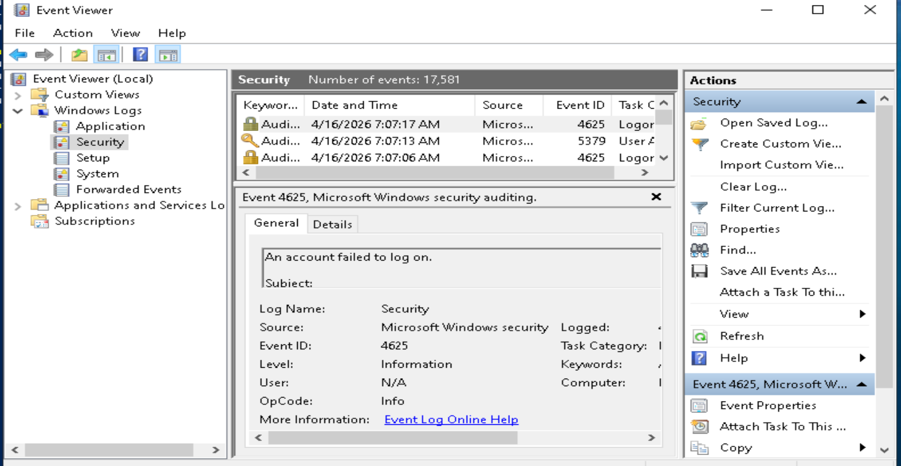
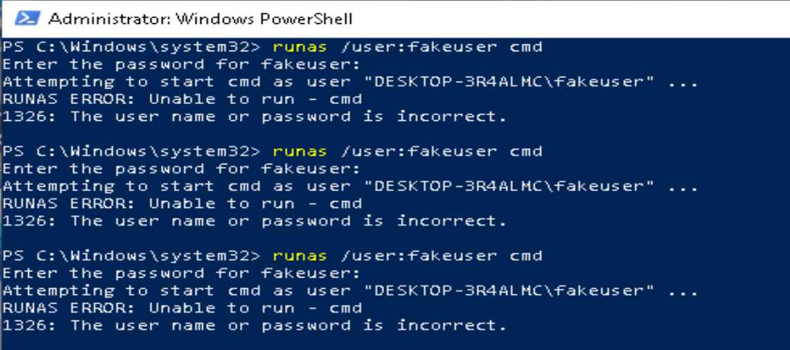
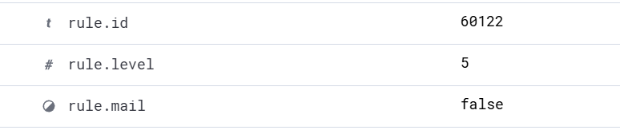
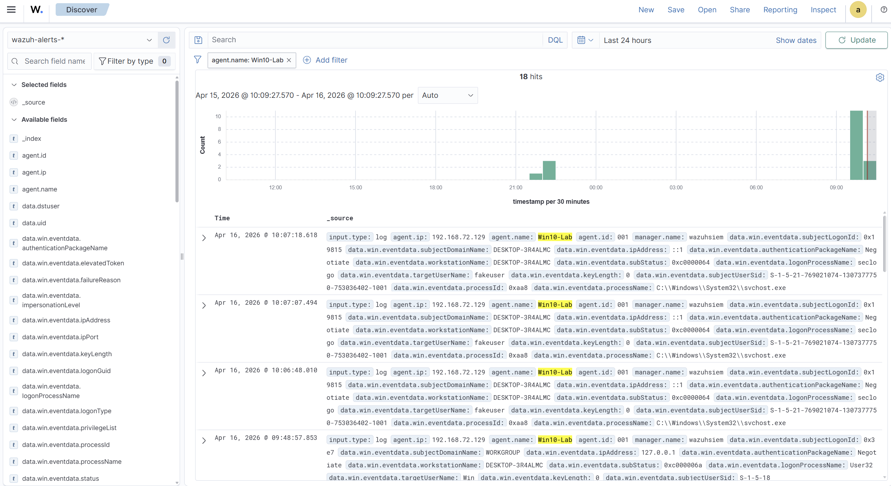

# Wazuh SIEM SOC Analyst Home Lab

## Overview
This project demonstrates the design and deployment of a Security Information and Event Management (SIEM) solution using Wazuh. The Lab simulates a real-world SOC environment where endpoint activity is monitored, security events are collected, and alerts are analyzed.

## Objective
The objective of this lab is to:  
-Deploy a fully functional SIEM using Wazuh.  
-Monitor endpoint activity from a Windows 10 machine.  
-Analyze security events and logs.  
-Build hands-on experience with SOC Analyst workflow.

## Lab Achitecture
  **Kali Linux**: Attack simulation machine  
  **Windows 10**: Monitored endpoint (Wazuh agent installed)  
  **Wazuh SIEM**: Centralized logging, detection, and visualization 

## Technology Used
-Wazuh SIEM (Ubuntu 22.04 LTS Server)  
-Kali Linux (Attack Simulation)  
-Windows 10 (Endpoint with Wazuh Agent)  
-Linux Command Line-Powershell-VMware

## Installation & Setup

### Kali Linux Setup
-Download the Debian 13.x 64-bit iso from https://www.kali.org/get-kali/#kali-platforms.  
-In VMware create new machine.  
-After installation run sudo apt update && sudo apt upgrade -y to apply any updates.  
-Run sudo apt install open-vm-tools open-vm-tools-desktop -y to install VMware tools

### Windows 10 Setup
-Download Windows 10 iso from the offical Microsoft website https://www.microsoft.com/en-us/software-download/windows10?msockid=28f471f593d16ad6311866e992b66b11.  
-Create a new machine in VMware.-Install Sysmon by running sysmon64.eexe -accepteula -i sysmonconfig.xml in Powershell.  
-Download Windows agent from Wazuh dashboard.  
-Run net start wazuh in Powershell.

### Wazuh SIEM (Ubuntu Server 22.04 LTS)
-Downloaded the Wazuh installation script:  
curl -sO https://packages.wazuh.com/4.14/wazuh-install.sh  
-Made the script executable:  
--chmod +x wazuh-install.sh  
-Ran the installation:  
--sudo bash wazuh-install.sh  
-Verified services:  
--sudo systemctl status wazuh-manager  
--sudo systemctl status wazuh-indexer  
--sudo systemctl status wazuh-dashboard  
--sudo systemctl status filebeat

## Log Ingestion Verification
-Navigated to:  
--Explore  
---Discover  
Confirmed that logs were being ingested from the Windows agent.

## Current Status
The SIEM environment is fully operational:  
-Wazuh Manager, Indexer, Dashboard, and Filebeat are running.  
-Windows agent successfully connected.  
-Logs are being ingested and analyzed.

---

## Attack Simulation: Failed Login Attempts
### Objective  
Simulate unauthorized access attemps against a Windows 10 endpoint and verify detection within the Wazuh SIEM.

---

### Method
Failed login attempts were generated using the Windows 'runas' command with invalid credentials.  

Steps:  
1. Opened Powershell (Run as Administrator)
2. Executed the following command:

   runas /user:fakeuser cmd

3. Entered an incorrect password when prompted
4. Repeated the process three times to simulate multiple failed login attempts

---

### Detection
The activity generated Windows Security Event Logs, which were successfully ingested by Wazuh.  

-**Event ID:** 4625 (Failed Logon)  
-**Wazuh Alert Level:** 5 (Medium severity)  
-**Agent:** Windows 10 endpoint  

Key fields observed:  
- 'rule.description': Windows logon failure
- 'rule.level': 5
- 'agent name': Win10-Lab
- 'data.win.system.eventID': 4625
  
---

### Analysis
The repeated failed login attempts indicate potential unauthorized access activity. While the attempts used a non-existent user account, they still triggered authentication failure events  with Windows.

---

### Outcome
This simulation confirmed that:  
-Windows Security logs are being generated correctly  
-The Wazuh agnet is successfully collecting and forwarding logs  
-Failed authentication attempts are detectable within the SIEM  

---

### Evidence

-Event Viewer showing Event ID 4625  
-Wazuh Discovery view showing corresponding alerts  
-Expanded log details with event fields

---

## Author
Sean M. Bonner

